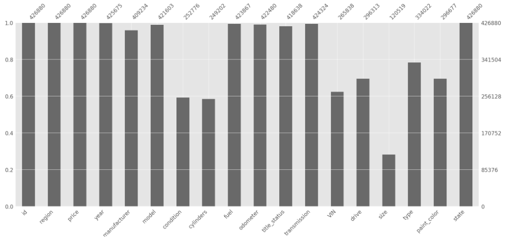
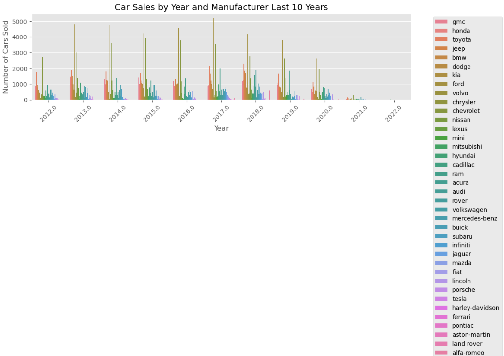

# What Drives the Prices of a Used Car? 
Dataset explored [here:](https://github.com/jing-li528/Used_car_sales/blob/main/data.zip)
Jupyter Notebook with Code [here:](https://github.com/jing-li528/Used_car_sales/blob/main/used_car_sales_prediction.ipynb) 

## Objective 
Used car prices can be driven by customer preferences on the cars' features. The purpose of this analysis is to: 1) gain understanding of customer preferences in a used car; 2) create a machine learning model to predict used car sale prices to provide used car dealership with actional insights for procuring inventory. 

## Data
This dataset was from Kaggle. The original dataset contained information on 3MM used cars. However, in this dataset we truncated to 426K cars to minimize speed of analysis. 
The dataset had total of 18 columns with significant share of missing values in some of the columns, see below bar graph: 

Columns with more than 20% missing values, or uninformative are dropped for further analysis. 

## Findings
### Out of the used cars sold for non-zero prices: 
1. The top 10 makers (manufacturer) sold include: Ford, Chevrolet, Toyota, Honda, Nissan, Jeep, Dodge, GMC, BMW, and Mercendez-Benz, which has been consistent for the last 10 years (see graph below)
2. The top 3 models sold include: F-150, Silverado 1500, and Camry.
3. The top 3 types sold include: Sedan, SUV, and Pickup truck.
4. The top 3 paint color sold include: White, Black, and Silver.

